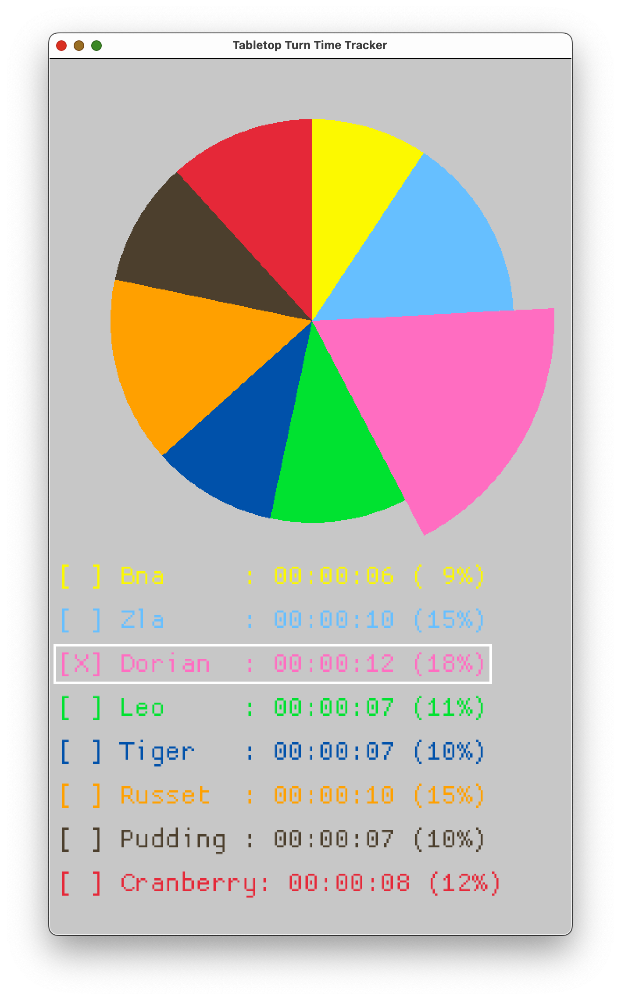
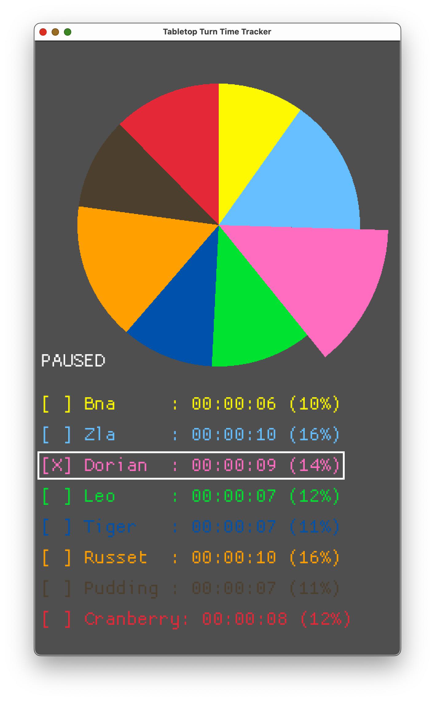

# turn-time-tracker

A helpful tool for finding who's turn is taking the most time when playing tabletop games together.

 | 

# Usage

Currently, player names, color, and ordering must be done in `main.rs`, and then compile and start the app via `cargo run`.

Maybe I'll eventually get around to implementing UI to select players at runtime, but for now this does what I need.

# Misc Learning Docs

Main learning take-away: Macroquad is good for drawing, bevy is good for ECS. I'm just doing some 

* https://macroquad.rs/examples/
* https://www.reddit.com/r/rust_gamedev/comments/oz5kd9/macroquad_vs_bevy/
* https://bevyengine.org/learn/quick-start/getting-started/ecs/