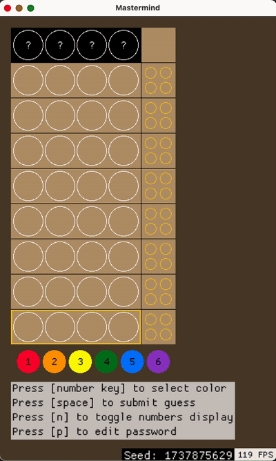

# mastermind

Implementation of https://en.wikipedia.org/wiki/Mastermind_(board_game) where you try to guess a secret password consisting of 4 colored pegs.

# Usage

The main way to play is to try to crack randomly generated codes. You can also kind of play a 2-player mode where player A enters the password and player B tries to guess it, then player B enters the password and player A tries to guess it.

## Controls

* **1-6** - press number key to select color
* **left-click** - fill slot with selected color
* **right-click** - unfill slot's color
* **space** - submit guess
* **n** - toggle display of number overlay
* **p** - when a game is unstarted (0 guess, all slots blank), press p to be able to manually edit the password, and press p again to lock in the password. This allows for 2-player local play.

# Example

