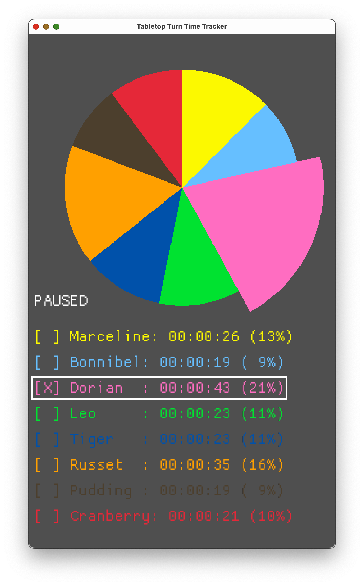

# turn-time-tracker

A helpful tool for finding who's turn is taking the most time when playing tabletop games together.

# Usage

Currently, player names, color, and ordering must be done in `main.rs`, and then compile and start the app via `cargo run`.

Maybe I'll eventually get around to implementing UI to select players at runtime, but for now this does what I need.

## Controls

* **spacebar** - next player's turn
* **p** - pause/unpause
* **h** - hide timer and pie to only show the currently active player
* **d** - detailed stats toggle

# Examples

